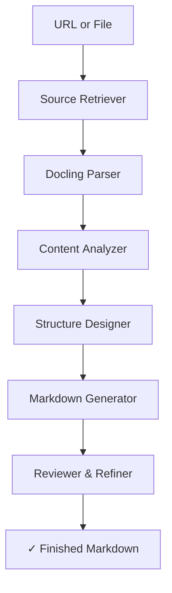

# AI Tutorial Generator

**Turn any PDF or web page into a polished, step‑by‑step Markdown tutorial — automatically.**
Built with a modular *agent* architecture powered by [beeai‑framework] + [Docling] and Granite LLMs (IBM Watson x / local Ollama).

---

## 1 · How it works  ⚙️

1. **SourceRetrieverAgent** – downloads a URL or reads a local file.
2. **DocumentParserAgent** – parses PDF / HTML into text chunks with *Docling*.
3. **ContentAnalyzerAgent** – classifies every chunk (title, step, code…) and writes a one‑sentence English summary.
4. **TutorialStructureAgent** – designs a coherent outline (JSON).
5. **MarkdownGenerationAgent** – expands the outline into a full Markdown tutorial.
6. **ReviewerRefinerAgent** – final language & style polish.



---

## 2 · Features  ✨

| Stage                     | What it does                                                                                        |
| ------------------------- | --------------------------------------------------------------------------------------------------- |
| `SourceRetrieverAgent`    | Resilient HTTP fetch with retries, auto‑saves PDFs to a temp file and cleans them up on exit.       |
| `DocumentParserAgent`     | Uses Docling’s `DocumentConverter` + `HybridChunker` for consistent PDF / HTML parsing.             |
| `ContentAnalyzerAgent`    | Calls Granite (Watson x or Ollama) to tag each block’s role and write a 1‑sentence English summary. |
| `TutorialStructureAgent`  | Produces a hierarchical outline in **JSON** (Introduction → Steps → Examples → Conclusion).         |
| `MarkdownGenerationAgent` | Fills the outline with explanations, tips, and fenced code blocks.                                  |
| `ReviewerRefinerAgent`    | Single LLM pass to smooth flow, fix grammar, and ensure proper Markdown.                            |
| **CLI**                   | `python -m src.main <source>` → prints Markdown / JSON.                                             |
| **Web UI**                | Minimal Flask app (`app.py`) with an upload wizard.                                                 |

---

## 3 · Installation 📦

```bash
# 1 Clone
git clone https://github.com/your-org/ai-tutorial-generator.git
cd ai-tutorial-generator

# 2 Python env
python -m venv .venv && source .venv/bin/activate

# 3 Dependencies
pip install -r requirements.txt
```

### Optional · Local Ollama backend

```bash
brew install ollama        # or visit https://ollama.ai
ollama pull granite:8b-instruct-q4_K_M
ollama serve &
```

---

## 4 · Configuration 🗝️

All credentials live in `.env` (a template is provided at `.env.sample`).

```dotenv
# Choose the LLM backend:  watsonx   |   ollama
LLM_BACKEND=ollama

# Watson x (needed if LLM_BACKEND=watsonx)
WATSONX_PROJECT_ID=***
WATSONX_API_KEY=***
WATSONX_API_URL=https://bam-api.res.ibm.com/v2/text

# Ollama (needed if LLM_BACKEND=ollama)
OLLAMA_BASE_URL=http://localhost:11434
OLLAMA_MODEL_ID=granite:8b-instruct-q4_K_M

# Optional tuning
LLM_MAX_QPS=8                  # global request limiter
DAYS_PER_MONTH=30.4375
```

> **Tip:** when `LLM_BACKEND=ollama` no external network calls are made — ideal for completely offline use.

---

## 5 · Usage 🚀

### CLI

```bash
python -m src.main ./docs/sample.pdf          # prints Markdown to stdout
python -m src.main https://example.com/page   -o tutorial.md   # save to file
python -m src.main page.html --json           # return full JSON payload
```

### Flask Web UI

```bash
python app.py
# open http://localhost:8000 in your browser
```

Upload a file, wait a few seconds, and copy / download the generated tutorial.

---

## 6 · Example 🧑‍💻

```bash
python -m src.main https://www.adobe.com/support/products/enterprise/knowledgecenter/media/c4611_sample_explain.pdf \
       -o sample-tutorial.md
code sample-tutorial.md        # open in your editor
```

---

## 7 · Project Tree 🌲

```
tutorial_generator/
├── README.md                ← you are here
├── .env.sample
├── requirements.txt
├── app.py                   ← Flask front‑end
│
├── src/
│   ├── config.py            ← single LLM “singleton”
│   ├── main.py              ← CLI entry‑point
│   ├── workflows.py         ← end‑to‑end orchestration
│   ├── agents/
│   │   ├── content_analyzer_agent.py
│   │   ├── document_parser_agent.py
│   │   ├── markdown_generation_agent.py
│   │   ├── reviewer_refiner_agent.py
│   │   ├── source_retriever_agent.py
│   │   └── tutorial_structure_agent.py
│   └── utils/
│       └── rate_limit.py
└── templates/  static/  docs/ …
```

---

## 8 · Troubleshooting 🛠️

| Symptom                            | Fix                                                                               |
| ---------------------------------- | --------------------------------------------------------------------------------- |
| **`ImportError: docling`**         | `pip install docling`                                                             |
| **`FileNotFoundError`** for `.env` | Copy `.env.sample` → `.env` and fill in credentials.                              |
| Model returns *empty outline*      | Check `llm_model` in `.env` — Granite 8B works well; smaller models may struggle. |
| Large PDF very slow                | Split the PDF or increase `OLLAMA_NUM_CTX`.                                       |
| Out‑of‑memory on Ollama            | Use a quantised model (`…q4_K_M`).                                                |

---

## 9 · Contributing 🤝

* Fork → feature branch → pull request.
* Please include unit tests where practical (pytest).
* Join the discussion in Issues for ideas & feedback.

---

Made with ☕ and open‑source tools. Enjoy creating tutorials the easy way!

[beeai‑framework]: https://github.com/beeai/beeai-framework
[Docling]: https://github.com/docling/docling
