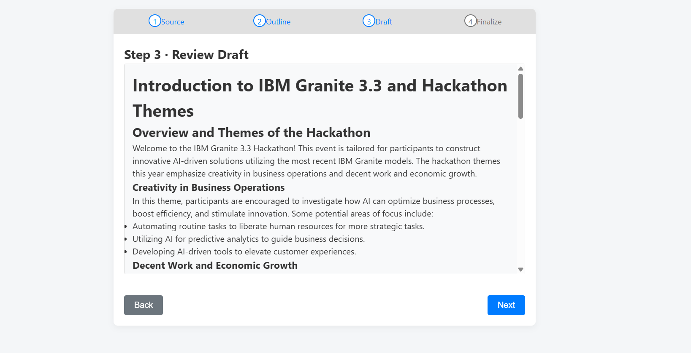

# AI Tutorial Generator 🚀  

*From raw PDF or web page to a beautifully‑structured, step‑by‑step Markdown tutorial—fully automated.*

---

## 1 · Why this project? 🤔

Tech writers and educators spend hours distilling source material into easy‑to‑follow tutorials.  
**AI Tutorial Generator** removes that friction:

* **One‑click:** drop a PDF / paste a URL → get a polished tutorial.  
* **Multi‑agent architecture:** each agent focuses on a tiny task (retrieve, parse, analyse, structure, write, refine).  
* **Pluggable LLM back‑ends:**  
  * **Local** — Ollama + Granite 8 B (works offline, CPU‑only OK)  
  * **Cloud** — IBM Watson x.ai (Granite 13 B, Llama 3 2‑3 B, Mistral Large…)

---

## 2 · Architecture 🧩

```mermaid
flowchart TD
    subgraph Retrieval["✂ Retrieval & Parsing"]
        A["① Source URI / File"] --> B[SourceRetrieverAgent]
        B --> C[DocumentParserAgent]
    end
    subgraph Analysis["🔍 Analysis & Structuring"]
        C --> D[ContentAnalyzerAgent]
        D --> E[TutorialStructureAgent]
    end
    subgraph Generation["✍ Generation & Refinement"]
        E --> F[MarkdownGenerationAgent]
        F --> G[ReviewerRefinerAgent]
        G --> H["✅ Markdown Tutorial"]
    end

    style Retrieval    fill:#eef,stroke:#6ba4ff,stroke-width:1px
    style Analysis     fill:#eafbe7,stroke:#5cb85c,stroke-width:1px
    style Generation   fill:#fff2e6,stroke:#f0ad4e,stroke-width:1px
````

*Each arrow is an async call; every box is an **Agent** (`run()` coroutine).*

---

## 3 · Key features ✨

| Agent                       | What it does                                                             |
| --------------------------- | ------------------------------------------------------------------------ |
| **SourceRetrieverAgent**    | Downloads a URL / accepts file upload, detects PDF vs HTML.              |
| **DocumentParserAgent**     | Uses **Docling** + Poppler to extract clean text blocks.                 |
| **ContentAnalyzerAgent**    | Tags each block (`title`, `code`, `step`…) + 1‑sentence summary via LLM. |
| **TutorialStructureAgent**  | Produces JSON outline (Intro → Steps → Examples → Conclusion).           |
| **MarkdownGenerationAgent** | Expands outline into full Markdown with code blocks, tips, warnings.     |
| **ReviewerRefinerAgent**    | Final polish: grammar, style, length targets.                            |

---

## 4 · Configuration 🗝️

All credentials live in `.env` (template at `.env.sample`).

```dotenv
# Choose the LLM backend:  watsonx   |   ollama
LLM_BACKEND=ollama

# Watson x (needed if LLM_BACKEND=watsonx)
WATSONX_PROJECT_ID=***
WATSONX_API_KEY=***
WATSONX_API_URL=https://us-south.ml.cloud.ibm.com
WATSONX_MODEL_ID=ibm/granite-13b-instruct-v2

# Ollama (needed if LLM_BACKEND=ollama)
OLLAMA_BASE_URL=http://localhost:11434
OLLAMA_MODEL_ID=granite:8b-chat
OLLAMA_AUTO_PULL=1                 # pull model automatically if missing


```

> **Tip:** when `LLM_BACKEND=ollama` no external network calls are made—ideal for completely **offline** use.

---

## 5 · Installation & quick start 🛠️

```bash
git clone https://github.com/ruslanmv/ai-tutorial-generator.git
cd ai-tutorial-generator
python -m venv .venv && source .venv/bin/activate
pip install -r requirements.txt

# Local Ollama example
curl -fsSL https://ollama.ai/install.sh | sh
ollama serve &                      # starts daemon
ollama pull granite:8b-chat         # one‑time model download
```

---

## 6 · Usage 🚀

### CLI

```bash
python -m src.main input_docs/my_tutorial.pdf                        # prints Markdown
python -m src.main input_docs/another_article.html -o tutorial.md    # save to file
python -m src.main input_docs/my_tutorial.pdf --json                 # full JSON payload
```

### Flask Web UI

```bash
python app.py
# open http://localhost:8000
```

Upload a file or paste a URL, wait a few seconds, then download the tutorial.

---


## 7 · Example 🧑‍💻

```bash
python -m src.main https://www.adobe.com/support/products/enterprise/knowledgecenter/media/c4611_sample_explain.pdf \
       -o adobe-sample.md
code adobe-sample.md      # open in VS Code
```

---

## 8 · Supported Watson x model IDs  (2025‑05) 📜

| ID                               | Regions                         |
| -------------------------------- | ------------------------------- |
| **ibm/granite-13b-instruct-v2**  | au-syd, eu-de, jp-tok, us-south |
| ibm/granite-3-8b-instruct        | au-syd, eu-de, jp-tok, us-south |
| meta-llama/llama-3-2-3b-instruct | us-south                        |
| …                                | *(see IBM catalogue)*           |

Validation logic in `src/config.py` ensures you pick a compatible ID.

---

## 9 · Docker 🧩

```bash
docker build -t tutorial-gen .
docker run -p 8000:8000 --env-file .env tutorial-gen
```

*The image bundles Poppler + Ghostscript and installs the Ollama CLI.
If `LLM_BACKEND=ollama`, the container auto‑starts `ollama serve`.*

---

## 10 · Troubleshooting 🔍

| Symptom                             | Fix                                                               |
| ----------------------------------- | ----------------------------------------------------------------- |
| `model … not recognised` (Watson x) | Update `.env` with a valid `WATSONX_MODEL_ID` from the table.     |
| `ollama pull … file does not exist` | Wrong tag. Use `granite:8b-chat`, `llama3`, `mistral-large`, etc. |
| `poppler-utils not found`           | `sudo apt install poppler-utils ghostscript` (Linux).             |
| Very large PDF slow                 | Split into chapters or raise `OLLAMA_NUM_CTX`.                    |
| GPU OOM                             | Switch to quantised model (`…q4_K_M`) or CPU mode.                |

---

## 11 · Project layout 📂

```
ai-tutorial-generator/
├── app.py                 # Flask wizard
├── Dockerfile
├── .env.sample
├── requirements.txt
├── templates/             # wizard.html
├── static/                # app.js + style.css
└── src/
    ├── config.py          # picks Watsonx / Ollama
    ├── utils/ollama_helper.py
    ├── workflows.py       # end‑to‑end pipeline
    ├── main.py            # CV analysis demo
    └── agents/            # 6 modular agents
```

---

## 12 · Contributing 🤝

* Fork → feature branch → PR.
* Follow `flake8`, `black`, `mypy` conventions.
* Please add unit tests (pytest).

---

Made with ☕ and open‑source tools.
If this project saves you time, give it a ⭐️!

[beeai-framework]: https://github.com/beeai/beeai-framework
[Docling]: https://github.com/docling/docling
